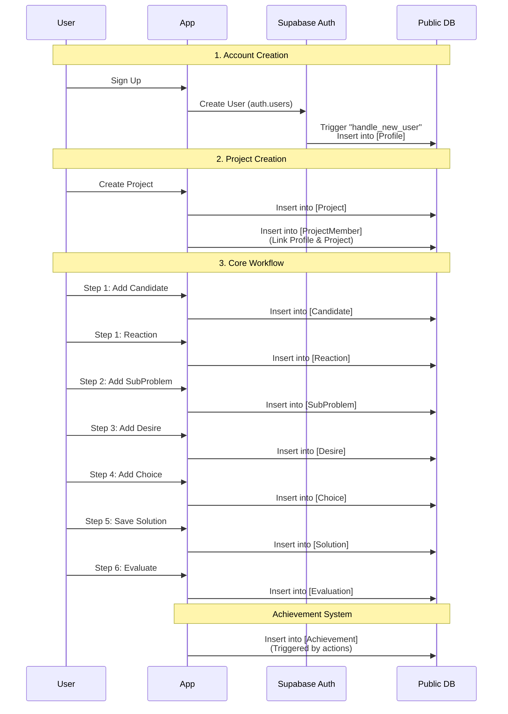

# Data Flow & Table Operations

## Table Columns Added By Phase

| Phase | Table | Trigger/Action | Key Columns |
|-------|-------|----------------|-------------|
| **Signup** | `Profile` | Auto-Trigger | `userId`, `username`, `avatarUrl` |
| **New Project** | `Project` | User Action | `name`, `description`, `inviteCode` |
| | `ProjectMember` | User Action | `projectId`, `profileId`, `role` |
| **Step 1** | `Candidate` | User Action | `projectId`, `title`, `authorId` |
| **Step 2** | `SubProblem` | User Action | `projectId`, `title` |
| **Step 3** | `Desire` | User Action | `projectId`, `type`, `content` |
| **Step 4** | `Choice` | User Action | `subProblemId`, `title`, `isOutsideDomain` |
| **Step 5** | `Solution` | User Action | `projectId`, `name`, `components` (JSON) |
| **Step 6** | `Evaluation` | User Action | `solutionId`, `desireId`, `score` |
